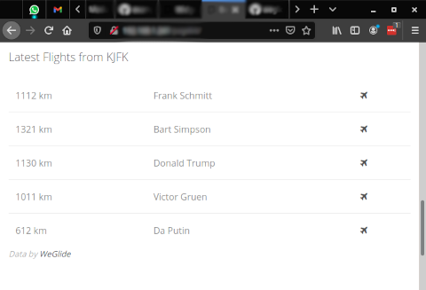

# Pagekit Extension for Weglide
The widgets of this extension visualize data from [weglide.org](https://www.weglide.org), a modern platform for scoring and analyzing glider cross-country flights.

Note that this extension simply makes use of their API and is not an official product of weglide.org

## Flights Widget
Simple list of flights with flown distance, the pilot's name and a link to the flight details page on weglide.org

## Development
### Prerequisites
- Pagekit instance for testing
- NodeJs, at least version 10.13.0 (LTS)

### Setup
1. Clone this repository, ideally into a working pagekit instance. Path should be `your-pagekit-folder/packages/robingoeppert/weglide/`, where "weglide" is the renamed repository root folder.
2. `npm install`

### Build
Build vue files by running `npx webpack` in pagekit root folder. This only works if the project is mounted in a pagekit instance as mentioned above.

### Deploy
Place all project files (including the built JS files in app/bundle) in your-pagekit-folder/packages/robingoeppert/weglide/